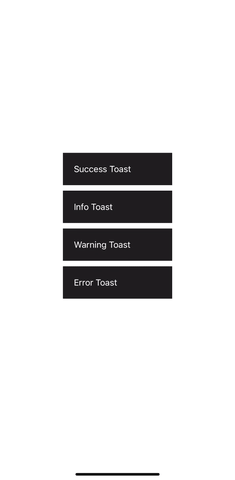

# react-native-toast-animated

An animated toast component for React Native



## Installation

```sh
// Using npm
npm install react-native-toast-animated

// Using yarn
yarn add react-native-toast-animated
```

## Usage

Wrap your App with `ToastProvider` component and pass your config object.

```js
import {
  ToastProvider,
  ToastPosition,
  type ConfigType,
} from 'react-native-toast-animated';

...

const config: ConfigType = {
  position: ToastPosition.TOP,
};

...

return (
    <ToastProvider config={config}>
      ...
    </ToastProvider>
  );
```

Then create your toast using the `useToast` hook and now you can show it with `show` function.

```js
import { useToast } from 'react-native-toast-animated';

...

const toast = useToast();

...

toast.show({
            type: 'success',
            text: 'This is a success toast',
            title: 'Success',
          })
```

## Documentation

## `Config`

A config object should be passed to `<ToastProvider>`. It contains all the necessary configuration for the Toast.

| Property | Required | Description | Type | Default value
| --- | --- | --- | --- | --- |
| `position` | true | Toast position: ToastPosition.TOP or ToastPosition.BOTTOM | ToastPosition | ToastPosition.TOP |
| `width` | false | Toast width | FlexStyle['width'] | '90%' |
| `height` | false | Toast height | FlexStyle['height'] ||
| `duration` | false | Duration before the toast automatically hides. Set to null if you don't want the toast to hide automatically | number \| null | 5000 |
| `showCloseIcon` | false | Show/hide the X button | boolean | true |
| `hideableByGesture` | false | Set to false if you don't want the toast to be hidden with gesture.<br>If set to true, you can hide the toast by dragging it to top if `position` is set to `ToastPosition.TOP` or to bottom if `position` is set to `ToastPosition.BOTTOM` | boolean | true |
| `colors` | false | To respect your design system, you can specify the colors property.<br>PS: colors specified here can be overriden by `containerStyle`, `titleStyle`, `textStyle` and `closeIconStyle`, | Colors (See next section) | (See next section) |
| `titleMaxLines` | false | Maximum number of lines. It will truncate title if it exceeds this number. | number | 1 |
| `textMaxLines` | false | Maximum number of lines. It will truncate text if it exceeds this number. | number | 2 |
| `containerStyle` | false | Override container style | StyleProp ||
| `titleStyle` | false | Override title style | StyleProp ||
| `textStyle` | false | Override text style | StyleProp ||
| `closeIconStyle` | false | Override close icon style | StyleProp ||

### Type

`ConfigType` type definition:

```js
export type ConfigType = {
  position: ToastPosition;
  width?: FlexStyle['width'];
  height?: FlexStyle['height'];
  duration?: number | null;
  showCloseIcon?: boolean;
  hideableByGesture?: boolean;
  colors?: Colors;
  titleMaxLines?: number;
  textMaxLines?: number;
  containerStyle?: StyleProp<ViewStyle>;
  titleStyle?: StyleProp<TextStyle>;
  textStyle?: StyleProp<TextStyle>;
  closeIconStyle?: StyleProp<TextStyle>;
};
```

### Colors

`Colors` type definition:

```js
export type Colors = {
  background?: string;
  title?: string;
  text?: string;
  closeIcon?: string;
  borderColor?: {
    success: string;
    info: string;
    warning: string;
    error: string;
  };
};
```

#### Default values

```js
export const colors = {
  background: '#1c1c1c',
  title: '#ffffff',
  text: '#ffffff',
  closeIcon: '#ffffff',
  borderColor: {
    success: '#24A148',
    info: '#0043ce',
    warning: '#ff832b',
    error: '#da1e28',
  },
};
```

## useToast

The `useToast` hook returns the `show` function

```js
const { show } = useToast();
```

### show

`show` function takes an object of type `ToastInfos` as parameter

```js
show({
      type: 'success', // required
      text: 'This is a success toast', // required
      title: 'Success', // optional
      onClick: () => console.log('Success'), // optional
    })
```

#### Type

```js
export type ToastInfos = {
  text: string;
  type: ToastType;
  title?: string;
  onClick?: () => void;
};
```

Possible toast types:

```js
type ToastType = 'success' | 'info' | 'warning' | 'error';
```

## Contributing

See the [contributing guide](CONTRIBUTING.md) to learn how to contribute to the repository and the development workflow.

## License

MIT

---

Made with [create-react-native-library](https://github.com/callstack/react-native-builder-bob)
